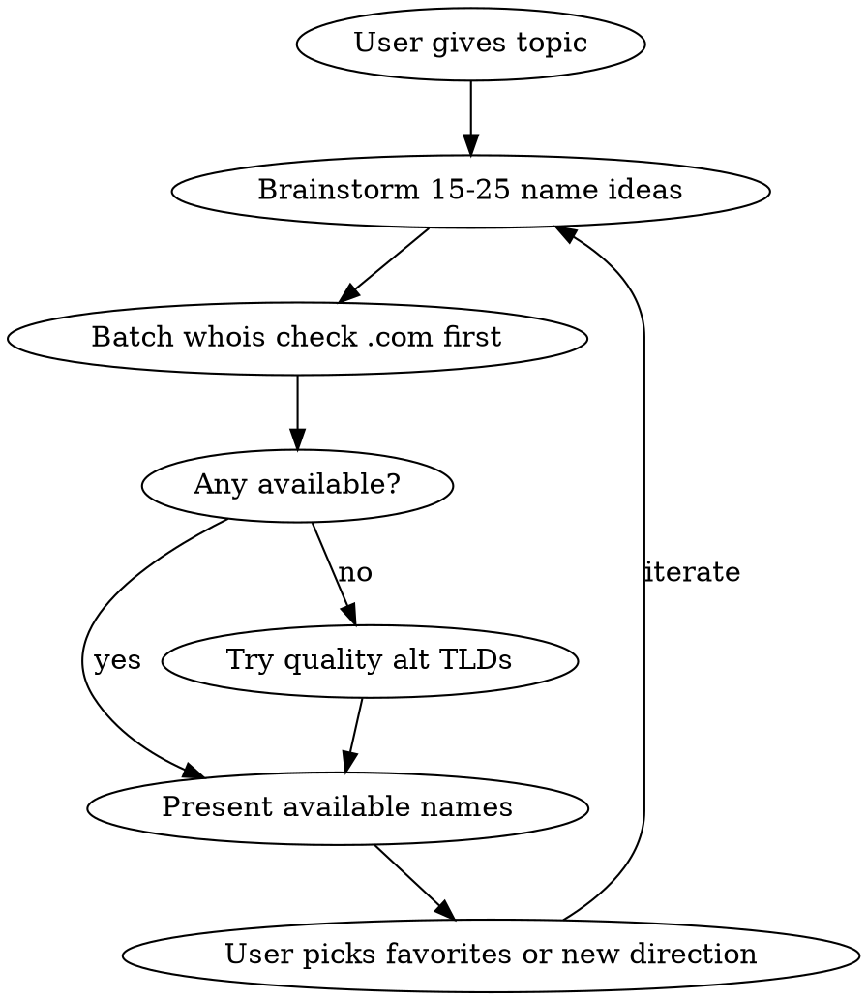

# Domain Name Finder

Find catchy, available domain names using whois lookups.

## Process



## Name Generation Rules

**Good names:**
- 2-3 syllables, rolls off the tongue (surfbomb, snapdrift, waveloom)
- Easy to spell when heard aloud - no ambiguous spellings
- Compound words: noun+noun, verb+noun, adj+noun
- Rhymes, alliteration, or rhythmic patterns
- Memorable, visual, evocative
- No hyphens, no numbers

**Techniques:**
- Mash two short words: surf+bomb, snap+fire, cloud+mint
- Portmanteaus: blend parts of words
- Invented but pronounceable: Spotify-style (not random chars)
- Action words + objects: LaunchPad, SnapGrid, DriftCode
- Nature + Tech: CoralByte, FernStack, MossWire
- Sound-alikes and wordplay

## TLD Priority

**Tier 1 (preferred):** .com, .io
**Tier 2 (good):** .co, .dev, .app, .ai, .so, .sh, .me, .to, .cc
**Tier 3 (acceptable):** .net, .org, .xyz, .tech, .site, .land, .run, .fun, .gg, .tv, .fm
**Avoid:** .biz, .info, .pro, .click, .loan, .top, .win, .review, .stream, .club, .online, .store, .website, country TLDs that look spammy (.tk, .ml, .ga, .cf, .gq)

Always try .com first. Only suggest alt TLDs if .com is taken.

## Whois Checking

Run whois checks in parallel batches using Bash:

```bash
# Check a single domain
whois example.com 2>&1 | grep -iE "No match|not found|No Data Found|Domain Name:|Registrar:|Creation Date" | head -5
```

**Available indicators:** "No match", "NOT FOUND", "No Data Found", "No entries found", "is free", "Status: free"
**Taken indicators:** "Domain Name:", "Registrar:", "Creation Date:", "Name Server:"

**Batch check pattern** (run in parallel):
```bash
for d in name1.com name2.com name3.com; do echo "=== $d ===" && whois "$d" 2>&1 | grep -iE "No match|not found|No Data Found|Domain Name:|Registrar:|Creation Date" | head -3; done
```

For non-.com TLDs, whois may not always work. If whois returns no useful data, note it as "unable to verify" and suggest the user check manually on namecheap.com or instantdomainsearch.com.

## Output Format

Present results as a clean table:

```
| Domain             | Status      | Notes                    |
|--------------------|-------------|--------------------------|
| surfbomb.com       | TAKEN       |                          |
| snapdrift.com      | AVAILABLE   | snap + drift, flows well |
| waveloom.io        | AVAILABLE   | wave + loom, visual      |
| cloudmint.com      | TAKEN       |                          |
| cloudmint.io       | AVAILABLE   | fallback TLD             |
```

After the table, highlight the best available options with brief rationale on why they're catchy.

## Iteration

After presenting results, ask the user:
- Want more names in a similar direction?
- Want to explore a different angle/vibe?
- Want to check specific names they thought of?
- Ready to register? Point them to namecheap.com or their preferred registrar.
